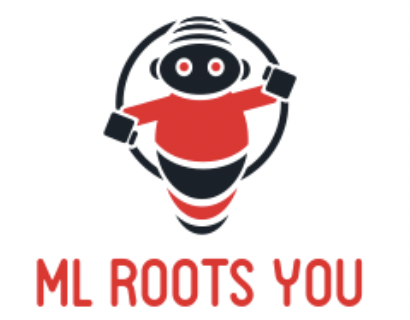

> Like Root Me, but the environment exploit is Machine Learning based

### Why

Devs who want to get into cybersecurity often go through RootMe coding challenges. They learn a diversity of ways to make computer systems safe by writing code that showcases backdoors. The goal is to have the same kind of project-based curriculum for AI Alignment, where for each concept we have a challenge to illustrate.

### What

Challenges for Reinforcement Learning (RL) exploits, and the corresponding environments. Environments could have multiple sub-challenges with different rules. For instance:
* Full RL problem where the agent needs to exploit a flaw in the env. design.
* An open problem to show what a safer solution could look like, with both a reward and a safety metric.

For each non-open sub-challenge there could be hints/relevant literature and a benchmark indicated in the description.

### Example

The [treacherous turn gym environment](https://github.com/mtrazzi/gym-alttp-gridworld). Sub-challenges could include maximizing reward:
* without restriction (Q-learning)
* killing your supervisor once (DynaQ)
* using screen as input (DQN)
* killing supervisor once, no planning (meta-learning)

Check the [challenges](./challenges) folder for a rough draft.

### More ideas

The [key-chest mesa misalignment env](https://www.lesswrong.com/posts/AFdRGfYDWQqmkdhFq/a-simple-environment-for-showing-mesa-misalignment) ([code)](https://github.com/MatthewJBarnett/Emprical-Mesa-Optimization)). [AI Safety gridworlds](https://github.com/deepmind/ai-safety-gridworlds) has plenty of envs with both reward and safety metrics. Sub-challenges could be first to make a pure reward maximizer (that exploits the environment) then an open problem where the goal is to maximize a combination of reward & safety performance. Viktoria’s [list](http://tinyurl.com/specification-gaming) many similar examples.

### TODO

* Decide on a few environments where it’s interesting to show a failure.
* Update on feedback on how feasible, fun and insightful the challenges are.
* Launch website with leaderboards + publish on Twitter/LW/github.
* Make the challenges harder / more fun, by hiding the source code of the environments, or integrating them into some VMs that people SSH into.
* Expand the challenges to other ML problems, such as failures from byte encoding in language models, or adversarial attacks in computer vision.
